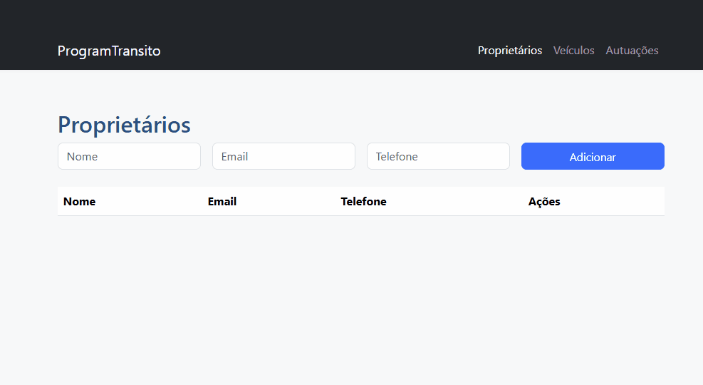
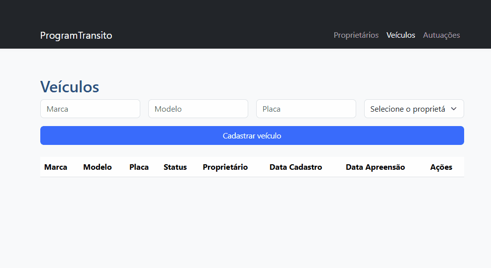
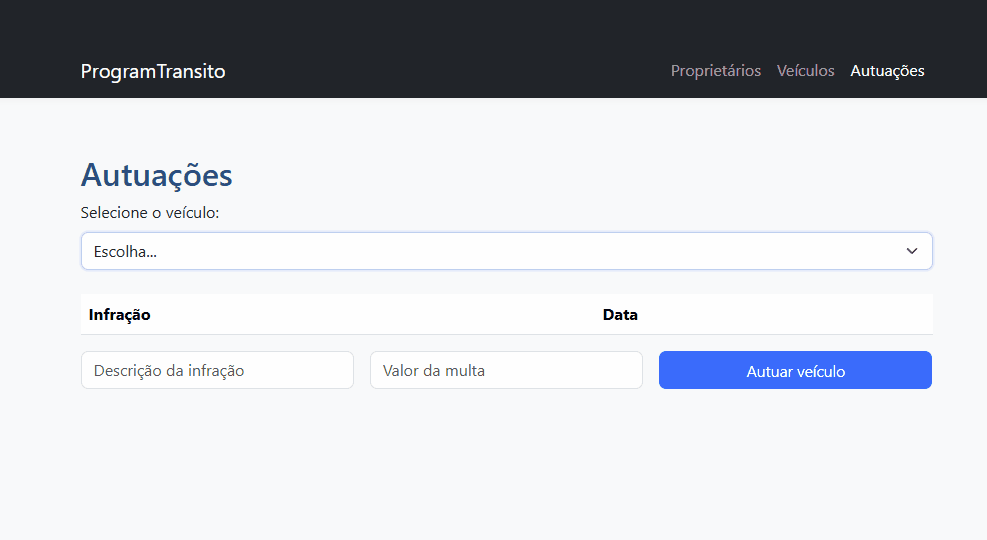

# 🚗 ProgramTransito API


Uma API REST robusta e bem arquitetada para gerenciamento de frota de veículos, proprietários e autuações, construída com as melhores práticas do ecossistema Spring e design de software moderno.

---

### 📖 Índice

- [Sobre o Projeto](#-sobre-o-projeto)
- [Exemplos de tela](#-exemplo-de-tela)
- [Tecnologias Utilizadas](#-tecnologias-utilizadas)
- [Funcionalidades](#-funcionalidades)
- [Arquitetura Aplicada](#-arquitetura-aplicada)
- [Modelo de Domínio](#-modelo-de-domínio)
- [Como Executar o Projeto](#-como-executar-o-projeto)
- [Endpoints da API](#-endpoints-da-api)
- [Autor](#-autor)

---

## 🖼️ Exemplos de Tela

### Tela de Proprietários (Desktop)


### Tela de Veículos (Desktop)


### Tela de Autuações (Desktop)


### 🎯 Sobre o Projeto

A **ProgramTransito API** foi desenvolvida como uma solução back-end completa para o controle de trânsito. Ela não é apenas um CRUD, mas um sistema que implementa regras de negócio complexas, como o gerenciamento de estado dos veículos (regular, apreendido) e o registro de autuações vinculadas, garantindo integridade e consistência dos dados.

O grande diferencial deste projeto está na sua arquitetura, que prioriza o desacoplamento, a testabilidade e a manutenibilidade, utilizando conceitos de **Domain-Driven Design (DDD)** para criar um modelo de domínio rico e expressivo.

---

### 🚀 Tecnologias Utilizadas

Este projeto foi construído com um conjunto de tecnologias modernas e consolidadas no mercado:

- **Java 17**: Versão LTS mais recente, garantindo performance e segurança.
- **Spring Boot 3.x**: Framework principal para a construção da API REST.
- **Spring Data JPA**: Para persistência de dados de forma produtiva.
- **Hibernate**: Implementação JPA para mapeamento objeto-relacional.
- **MySQL**: Banco de dados relacional para armazenamento dos dados.
- **Flyway**: Ferramenta para versionamento e migração de schema do banco de dados, garantindo um deploy consistente.
- **Maven**: Gerenciador de dependências e build do projeto.
- **Lombok**: Para reduzir código boilerplate em modelos e componentes.
- **ModelMapper**: Biblioteca para mapeamento eficiente entre DTOs e Entidades.
- **Jakarta Bean Validation**: Para validação declarativa dos dados de entrada.

---

### ✨ Funcionalidades

- ✅ Gerenciamento completo de **Proprietários** (CRUD).
- ✅ Gerenciamento completo de **Veículos** (CRUD).
- ✅ Sistema de **Autuações**, permitindo registrar e listar infrações por veículo.
- ✅ Controle de estado do veículo através de endpoints RESTful para **Apreensão** e **Remoção de Apreensão**.
- ✅ Validações de regras de negócio, como unicidade de placa de veículo e e-mail de proprietário.

---

### 🏛️ Arquitetura Aplicada

A qualidade deste projeto reside em sua arquitetura cuidadosamente planejada:

#### 1. Arquitetura em Camadas (Layered Architecture)
O projeto é claramente dividido em camadas de responsabilidade:
- **API (Controller)**: Responsável por expor os endpoints, receber requisições e retornar respostas.
- **Domain (Service, Model, Repository)**: O coração da aplicação, contendo as regras de negócio, entidades e a lógica de acesso a dados.

#### 2. Padrão DTO (Data Transfer Object) com Assemblers
Utilizamos o padrão DTO para desacoplar a representação da API do modelo de domínio interno.
- **Input Models**: Objetos que representam os dados de entrada da API.
- **Representation Models**: Objetos que modelam as respostas da API.
- **Assemblers**: Componentes responsáveis por converter Entidades em DTOs e vice-versa, mantendo os controllers limpos.

#### 3. Modelo de Domínio Rico (Rich Domain Model)
Seguindo princípios do DDD, a lógica de negócio que pertence a uma entidade é encapsulada dentro da própria entidade. Por exemplo, a ação de `adicionarAutuacao` ou `apreender` um veículo é um método do próprio modelo `Veiculo`, tornando o código mais coeso, orientado a objetos e fácil de entender.

---

### 📊 Modelo de Domínio

Este diagrama de classes representa o modelo de domínio principal da aplicação, ilustrando as entidades, seus atributos e os relacionamentos entre elas.


*Para uma visualização detalhada das classes, atributos e relacionamentos, consulte o diagrama acima.*

---

### 💻 Como Executar o Projeto

Siga os passos abaixo para executar a aplicação localmente.

**Pré-requisitos:**
- Java 17 ou superior
- Maven 3.8 ou superior
- Uma instância do MySQL em execução

**Passos:**

1. **Clone o repositório:**
   ```bash
   git clone [https://github.com/seu-usuario/programtransito-api.git](https://github.com/seu-usuario/programtransito-api.git)
   cd programtransito-api
   ```

2. **Configure o banco de dados:**
    - Abra o arquivo `src/main/resources/application.properties`.
    - Altere as propriedades `spring.datasource.username` e `spring.datasource.password` com suas credenciais do MySQL. O banco de dados `programtransito` será criado automaticamente pelo Flyway se não existir.

   ```properties
   # BANCO DE DADOS
   spring.datasource.url=jdbc:mysql://localhost:3306/programtransito?createDatabaseIfNotExist=true
   spring.datasource.username=seu-usuario
   spring.datasource.password=sua-senha

   # DESABILITA O HIBERNATE DDL-AUTO, POIS O FLYWAY GERENCIA O SCHEMA
   spring.jpa.hibernate.ddl-auto=none

   # FLYWAY
   spring.flyway.locations=classpath:db/migration
   ```

3. **Execute a aplicação:**
   ```bash
   mvn spring-boot:run
   ```
   A API estará disponível em `http://localhost:8080`.

---

### 🔌 Endpoints da API

Aqui estão os principais endpoints disponíveis:

```http
### Proprietários
GET /proprietarios
GET /proprietarios/{proprietarioId}
POST /proprietarios
PUT /proprietarios/{proprietarioId}
DELETE /proprietarios/{proprietarioId}

### Veículos
GET /veiculos
GET /veiculos/{veiculoId}
POST /veiculos

### Autuações (como sub-recurso de Veículo)
GET /veiculos/{veiculoId}/autuacoes
POST /veiculos/{veiculoId}/autuacoes

### Gerenciamento de Estado de Apreensão
PUT /veiculos/{veiculoId}/apreensao
DELETE /veiculos/{veiculoId}/apreensao
```

---

### 👨‍💻 Autor

Feito com ❤️ por **Caio Filardis**.

[](https://www.linkedin.com/in/caiofilardis/)
[](https://github.com/CaioFilardis)

---